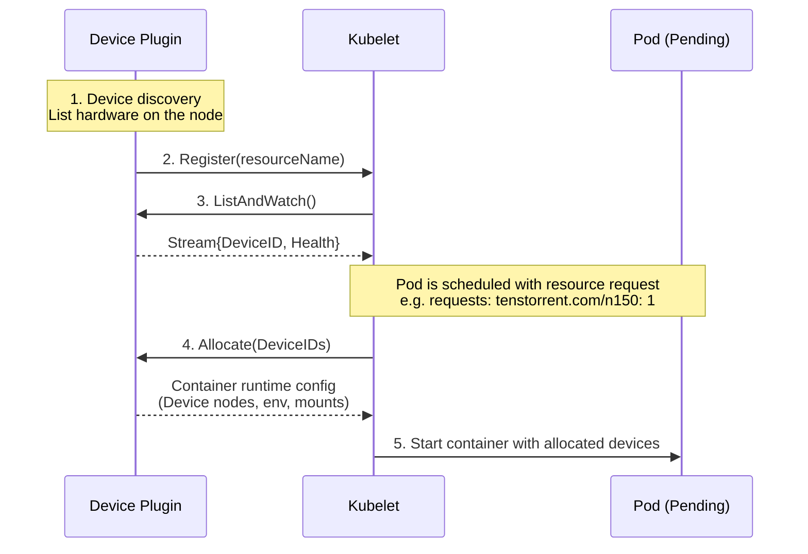

# Tenstorrent device plugin for Kubernetes

## Summary

This plugin adds support for Tenstorrent devices to Kubernetes and reports device into to the kubelet. See [Device Plugins](https://kubernetes.io/docs/concepts/extend-kubernetes/compute-storage-net/device-plugins/) for upstream documentation.

## Prerequisites

To use this device plugin, you must first have already installed `tt-kmd` on the kubernetes hosts.
See [github.com/tenstorrent/tt-kmd](http://github.com/tenstorrent/tt-kmd).

## How it works

A device plugin is a small gRPC service on each node that discovers hardware, registers custom resources with tge kubelet, and when a Pod requests those resources, provides the runtime instructions needed to attach the device to the container.

You would typically find this information from `tt-smi -ls` or in the `/dev/tenstorrent` device tree.

Conceptually, you could then tell the kubelet about that and make a request for a card to get it scheduled. That process would look like this:

## Roadmap

- [ ] Enumerate the hardware
  - [x] a fake list at first
  - [ ] actual hardware
- [?] Implement the gRPC server for the Kubernetes Device Plugin API
  - [?] [Register](https://kubernetes.io/docs/concepts/extend-kubernetes/compute-storage-net/device-plugins/#device-plugin-registration)
- [?] Register with kubelet via the Unix socket
- [?] Return something valid from `Allocate()` ()
- [ ] Test E2E ([see Example](https://kubernetes.io/docs/concepts/extend-kubernetes/compute-storage-net/device-plugins/#example-pod))
