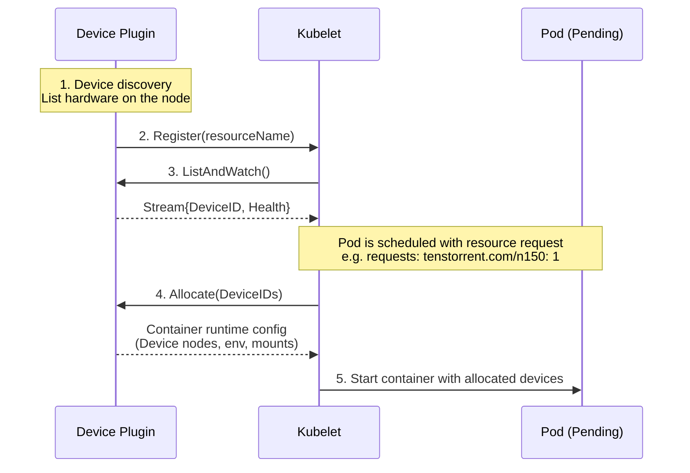

# Tenstorrent device plugin for Kubernetes

## Summary

This plugin adds support for Tenstorrent devices to Kubernetes and reports device into to the kubelet. See [Device Plugins](https://kubernetes.io/docs/concepts/extend-kubernetes/compute-storage-net/device-plugins/) for upstream documentation.

WARNING: This is in active development and is not complete. In the meantime, I suggest using [generic-device-plugin](https://github.com/squat/generic-device-plugin)

## Prerequisites

To use this device plugin, you must first have already installed `tt-kmd` on the kubernetes hosts.
See [github.com/tenstorrent/tt-kmd](http://github.com/tenstorrent/tt-kmd).

Be sure that hugepages are enabled and configured in your card hosts. You can confirm this with:

```sh
sudo cat /sys/kernel/mm/hugepages/hugepages-1048576kB/nr_hugepages
2
```

## Getting Started

You can deploy the tenstorrent `k8s-device-plugin` in kind by running:

```sh
kind create cluster -f kind.yaml

# Login to GHCR to avoid issues with transparent reads
# docker login ghcr.io

# Create a registry pull secret if you have issues with transparent pulls from GHCR
kubectl create secret generic regcred -n kube-system \
  --from-file=.dockerconfigjson=$HOME/.docker/config.json --type=kubernetes.io/dockerconfigjson

kubectl apply -f device-plugin-daemonset.yaml
```

You should then see a tenstorrent device in the `status.allocatable` portion of the nodeSpec:

```sh
kubectl get no kind-control-plane -o json | jq '.status.allocatable'
{
  "cpu": "10",
  "ephemeral-storage": "100476656Ki",
  "hugepages-2Mi": "0",
  "memory": "16359768Ki",
  "pods": "110",
  "tenstorrent.com/n150": "4"
}
```

With the plugin deployed, and devices showing up as allocatable, you can then schedule an example workload:

```sh
# You may need to create an image pull secret if you experience issues with transparent pulls from GHCR
kubectl apply -f example-workload.yaml
```

## How it works

A device plugin is a small gRPC service on each node that discovers hardware, registers custom resources with tge kubelet, and when a Pod requests those resources, provides the runtime instructions needed to attach the device to the container.

You would typically find this information from `tt-smi -ls` or in the `/dev/tenstorrent` device tree.

Conceptually, you could then tell the kubelet about that and make a request for a card to get it scheduled. That process would look like this:



## Reference

|Link|Description|
|-|-|
|[Device Plugin Docs](https://kubernetes.io/docs/concepts/extend-kubernetes/compute-storage-net/device-plugins)|A high level guide on how device plugins work|
|[tt-kmd](https://github.com/tenstorrent/tt-kmd)|Tenstorrent Kernel mode driver. A reference for how the device node(s) and sysfs is populated.|
|[tt-kmd sysfs attributes docs](https://github.com/tenstorrent/tt-kmd/blob/bda2c96c3a3eb5ee48db2f5a054a5fff83629d49/docs/sysfs-attributes.md)|Documentation specficially regarding the driver's sysfs device attributes|
|[Device Manager Proposal](https://github.com/kubernetes/design-proposals-archive/blob/main/resource-management/device-plugin.md)|Learn more about the design of the device manager and how it came to be|
|[Kubelet Device Manager code](https://github.com/kubernetes/kubernetes/blob/release-1.33/pkg/kubelet/cm/devicemanager/plugin/v1beta1/client.go)|This is the consumer of our DevicePlugin|
